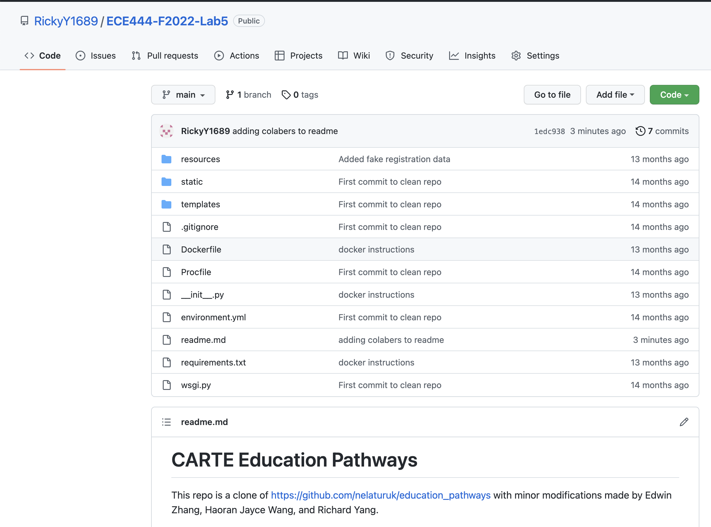

# CARTE Education Pathways
This repo is a clone of https://github.com/nelaturuk/education_pathways with minor modifications made by Edwin Zhang, Haoran Jayce Wang, and Richard Yang.

## Activity 1

## Activity 2-5

Screenshot of the homepage

Screenshot of the Results Page - Form & Table

## Activity 6

